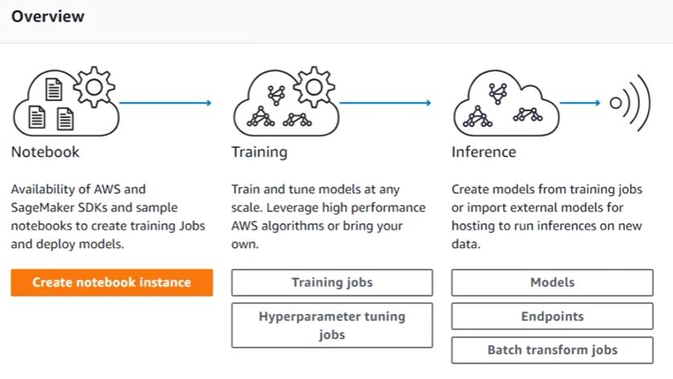

# Model Deployment with Amazon SageMaker

A repository containing some tutorial notebooks and projects on how to deploy ML models with AWS SageMaker.

1. Deployment (incl. hyperparameter-tuning)
2. Updating Models
3. Final project (deployment of a web app)

See separate README files in the respective subfolders for details.

The notebooks work with different features offered by Amazon's SageMaker service, including the following:

- **Notebook Instances** provide a convenient place to process and explore data in addition to making it very easy to interact with the rest of SageMaker's features.

- **Training Jobs** allow us to create model artifacts by fitting various machine learning models to data.

- **Hyperparameter Tuning** allows us to create multiple training jobs each with different hyperparameters in order to find the hyperparameters that work best for a given problem (see separate notebook).

- **Models** are essentially a combination of model artifacts formed during a training job and an associated docker container (code) that is used to perform inference.

- **Endpoint Configurations** act as blueprints for endpoints. They describe what sort of resources should be used when an endpoint is constructed along with which models should be used and, if multiple models are to be used, how the incoming data should be split up among the various models. (see A-B-testing notebook in `Updating Models` folder)

- **Endpoints** are the actual HTTP URLs that are created by SageMaker and which have properties specified by their associated endpoint configurations. Have you shut down your endpoints?

- **Batch Transform** is the method by which you can perform inference on a whole bunch of data at once. In contrast, setting up an endpoint allows you to perform inference on small amounts of data by sending it do the endpoint bit by bit.

In addition to the features provided by SageMaker we use **three other Amazon services**:

In particular, we use **S3** as a central repository in which to store our data. This includes test / training / validation data as well as model artifacts that we create during training.

We also look at how we can combine a deployed SageMaker endpoint with **Lambda** and **API Gateway** to create a simple web app.

## SageMaker Documentation

- Developer Documentation can be found [here](https://docs.aws.amazon.com/sagemaker/latest/dg/).
- Python SDK Documentation (also known as the high level approach) can be found [here](https://sagemaker.readthedocs.io/en/latest/).
- Python SDK Code can be found on github [here](https://github.com/aws/sagemaker-python-sdk).